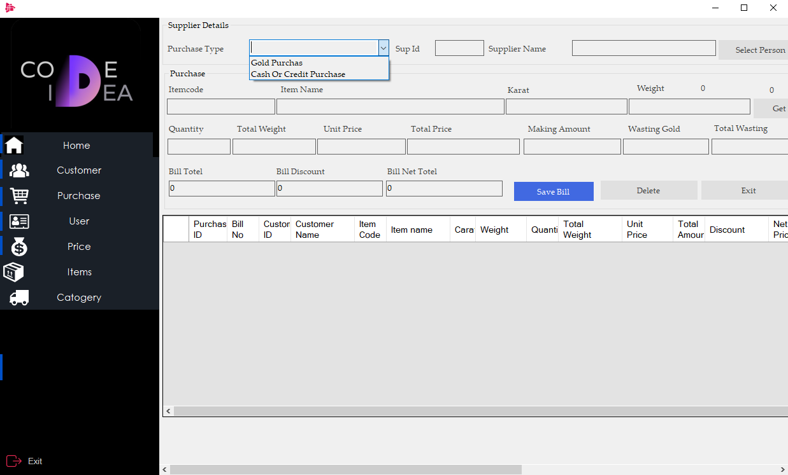

# Jewelry Management System :sparkles:

## Overview
This Jewelry management system utilizes .NET and MySQL, integrating proper OOP design and MySQL store procedures. It records sales, users, invoices, purchases, bank, and cheque details, making jewelry business management effortless.

## Features
- User-friendly interface
- Records sales, users, invoices, purchases, bank details, cheque details, and more
- Secure and efficient management of jewelry business data

## Screenshots

.png)

## Technical Requirements
- C#
- MySQL
 
## Conclusion
The Jewelry Management System is the perfect solution for jewelry shops looking for an easy and efficient way to manage their business operations. With its user-friendly interface, powerful features, and secure data management, this system is a must-have for jewelry businesses.
