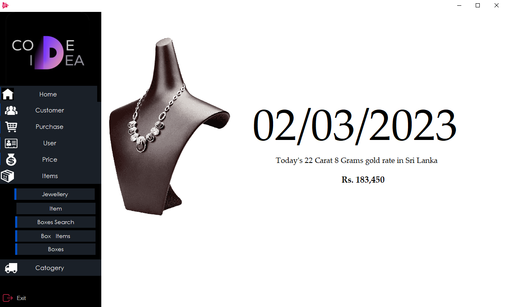
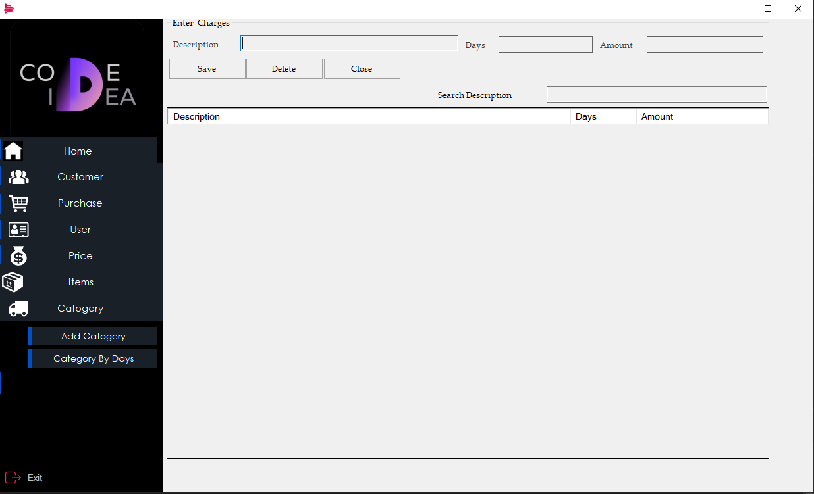
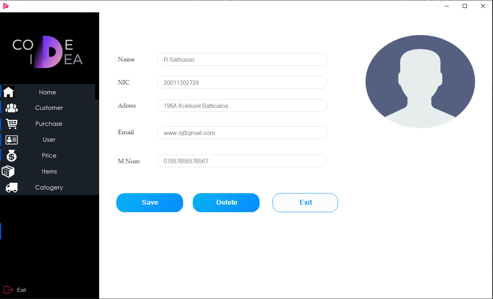

# Jewelry Management System :sparkles:

## Overview
This system is developed using C# and MySQL as the database to record the sales, users, invoices, purchases, bank details, cheque details, and more for a jewelry shop. With this system, managing a jewelry business has never been easier.

Features
- User-friendly interface
- Records sales, users, invoices, purchases, bank details, cheque details, and more
- Secure and efficient management of jewelry business data

## Screenshots

## Technical Requirements
- C#
- MySQL
 
## Conclusion
The Jewelry Management System is the perfect solution for jewelry shops looking for an easy and efficient way to manage their business operations. With its user-friendly interface, powerful features, and secure data management, this system is a must-have for jewelry businesses.
